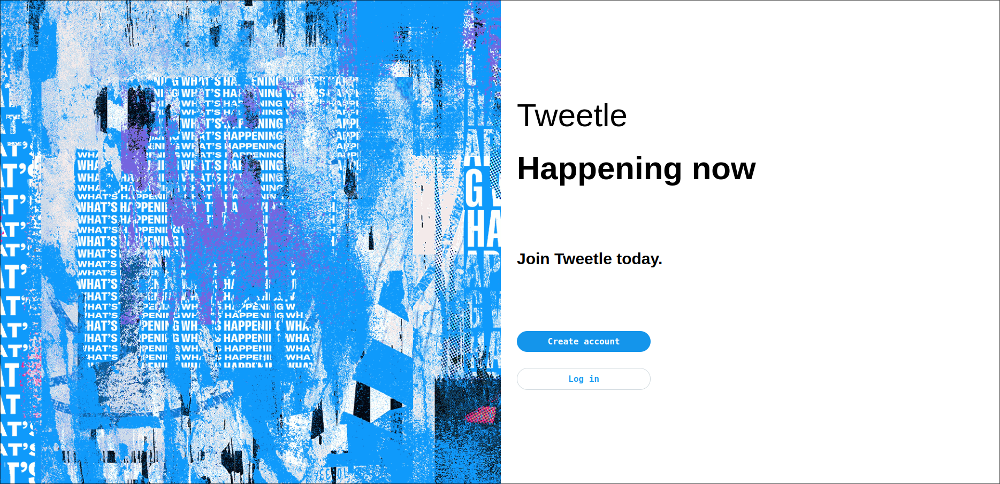

# Tweetle
Twitter clone made with Python Django.

## Progress



## Features

> - Create new account
> - Log into accounts
> - Make a new tweet
> - View other tweets
> - View user profiles

## Todo

> - User profile picture/banner/bio
> - User followers/followings/likes
> - Tweets comments/likes/shares
> - Tweet file attachments
> - Better website

## Running the code

In the terminal run:

```bash
$ python manage.py runserver
```

This will start the Django server on localhost port 8000.

Go to `http://localhost:8000/` to get to Tweetle's home page.